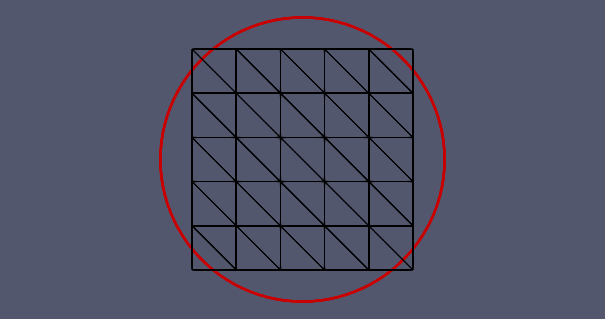

.. _example_dido:
.. role:: bash(code)
   :language: bash

Example 2: Dido's problem
=========================

In this example, we solve `Dido's problem <https://en.m.wikipedia.org/wiki/Dido>`_: find the two-dimensional
geometry with biggest area for a given perimeter. Mathematically,
this means minimizing the negative area

.. math::

    J(\Omega) = \int_\Omega (-1) \,\mathrm{d}\mathbf{x}

while keeping the perimeter

.. math::

    P(\Omega) = \int_\Omega (-1) \,\mathrm{d}s

constant. The solution to the problem is a disc with radius
:math:`r = P(\Omega)/(2\pi)`. In this example,
the initial domain is a unit square, which implies that
:math:`P(\Omega)= 4`. We thus aim to reconstruct a
disc of radius :math:`r = 2/\pi \approx 0.636619772367581` and
area :math:`r^2\pi \approx 1.273239544735163`.

In the following, we describe how to solve this problem in Fireshape.
The entire script is contained in the Python file 
:bash:`dido.py`, which is saved in the Fireshape repository and
can be found at the following link:
`link-to-dido-example <https://github.com/fireshape/fireshape/tree/master/examples/levelset/dido.py>`_.

Import modules
^^^^^^^^^^^^^^

We begin by importing Firedrake, Fireshape, and ROL. We also
import :bash:`fireshop.zoo`, which contains utilities to set
up the perimeter constraint.

.. literalinclude:: ../../examples/levelset/dido.py
    :lines: 1-4
    :linenos:
    :lineno-match:

Implement the shape function
^^^^^^^^^^^^^^^^^^^^^^^^^^^^
To implement the shape function :math:`J`, we use Fireshape's class
:bash:`PDEconstrainedObjective`. This requires specifying how to evaluate
:math:`J` in the method
:bash:`PDEconstrainedObjective.objective_value`.

.. literalinclude:: ../../examples/levelset/dido.py
    :lines: 7-12
    :linenos:
    :lineno-match:
    

.. note::

    Although :math:`J` is not technically constrained to a boundary
    value problem, it is convenient to use the class  :bash:`PDEconstrainedObjective`
    as this automatically returns :bash:`NaN` on poor quality meshes.

Select initial guess, control space, and inner product
^^^^^^^^^^^^^^^^^^^^^^^^^^^^^^^^^^^^^^^^^^^^^^^^^^^^^^
We select a unit square centered at :math:`(0.5,0.5)` as initial domain.
To modify the domain, we create a control space of geometric
transformations discretized using finite elements of degree 2.
(Note the additional input :bash:`add_to_degree_r=1` in the
definition of :bash:`Q`.) To compute
descent directions, we employ Riesz representatives of shape
derivatives with respect to a full :math:`H^1`-inner product.
With these, we create a control variable :bash:`q` that will
be updated by the optimization algorithm.

.. literalinclude:: ../../examples/levelset/dido.py
    :lines: 14-18
    :linenos:
    :lineno-match:

Instantiate objective function J
^^^^^^^^^^^^^^^^^^^^^^^^^^^^^^^^
We instantiate :math:`J(\Omega)` using the class
:bash:`NegativeArea` we have created. During instantiation,
we also pass a call back function :bash:`cb` that stores the
shape iterates whenever :bash:`J` is evaluated.

.. literalinclude:: ../../examples/levelset/dido.py
    :lines: 20-22
    :linenos:
    :lineno-match:

Instantiate equality constraint P
^^^^^^^^^^^^^^^^^^^^^^^^^^^^^^^^^
We instantiate :math:`P(\Omega)` using the class
:bash:`SurfaceAreaFunctional` from :bash:`fireshop.zoo`.

.. literalinclude:: ../../examples/levelset/dido.py
    :lines: 24-28
    :linenos:
    :lineno-match:

Select the optimization algorithm and solve the problem
^^^^^^^^^^^^^^^^^^^^^^^^^^^^^^^^^^^^^^^^^^^^^^^^^^^^^^^

Finally, we select an augmented Lagrangian optimization algorithm that uses
a trust-region optimization algorithm (with l-BFGS Hessian) to solve
the augmented Lagrangian subproblems. We carefully select and set the
optimization parameters in the dictionary
:bash:`pd`.  This, together with :bash:`J`, :bash:`q`, :bash:`econ`, and
:bash:`emul` are passed to ROL, which solves the problem.

.. literalinclude:: ../../examples/levelset/dido.py
    :lines: 30-48
    :linenos:
    :lineno-match:

Result
^^^^^^
Typing :bash:`python3 dido.py` in the terminal returns:

.. code-block:: none

     Augmented Lagrangian Solver
    Subproblem Solver: Trust Region
      iter  fval           cnorm          gLnorm         snorm          penalty   feasTol   optTol    #fval   #grad   #cval   subIter 
      0     -1.000000e+00  0.000000e+00   1.359583e+00                  1.00e+01  1.26e-01  1.36e-02  
      1     -1.477728e+00  3.093114e-01   3.244788e-02   4.698565e-01   1.00e+02  1.26e-01  1.00e-01  15      13      24      10      
      2     -1.274740e+00  2.943785e-03   1.042650e-01   5.678527e-01   1.00e+02  7.94e-02  1.00e-01  28      23      45      10      
      3     -1.272798e+00  1.229090e-04   7.903207e-02   1.968245e-02   1.00e+02  5.01e-02  1.00e-03  38      28      58      7       
      4     -1.273378e+00  3.158611e-04   1.664273e-01   5.434476e-02   1.00e+02  3.16e-02  1.00e-03  51      39      80      10      
      5     -1.273019e+00  3.230874e-04   1.760829e-02   5.272820e-02   1.00e+02  2.00e-02  1.00e-03  64      49      101     10      
      6     -1.273236e+00  4.254024e-06   7.637262e-03   1.757102e-03   1.00e+02  1.26e-02  1.00e-03  77      59      122     10         
    Optimization Terminated with Status: Converged

This output implies that the retrieved optimal negative area is approximately :bash:`-1.273236e+00`
and that the (perimeter) equality constraint violation is approximately (only)
:bash:`4.254024e-06`.

We can inspect the result by opening the file :bash:`levelset_domain.pvd`
with `ParaView <https://www.paraview.org/>`_. In the GIF below, we see that
the domain (black grid) converges to the right shape (red circle). Note that the
mesh presents bent edges due to using finite elements of degree 2 to discretize
domain updates.

