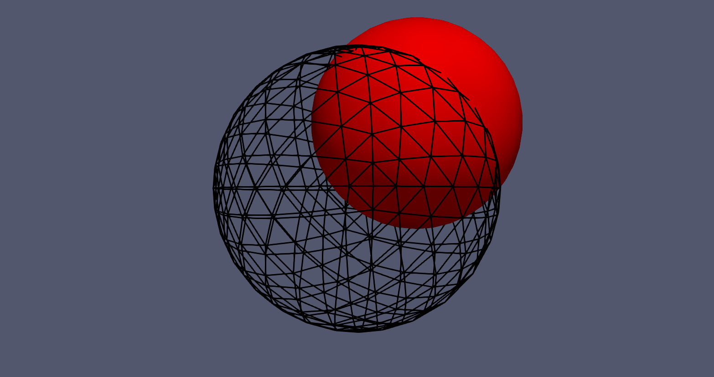

.. _example_levelset:
.. role:: bash(code)
   :language: bash

Example 1: Level Set
====================

In this example, we show how to minimize the shape function

.. math::

    J(\Omega) = \int_\Omega f(\mathbf{x}) \,\mathrm{d}\mathbf{x}\,,

where :math:`f:\mathbb{R}^3\to\mathbb{R}` is a scalar function.
In particular, we consider

.. math::

    f(x,y,z) = (x - 0.5)^2 + (y - 0.5)^2 + (z - 0.5)^2 - 0.64\,.

The domain that minimizes :math:`J(\Omega)` is a
ball of radius :math:`0.8` centered at :math:`(0.5,0.5,0.5)`.

In the following, we describe how to solve this problem in Fireshape.
The entire script is contained in the Python file 
:bash:`levelset.py`, which is saved in the Fireshape repository and
can be found at the following link:
`link-to-levelset-example <https://github.com/fireshape/fireshape/tree/master/examples/levelset/levelset.py>`_.

Import modules
^^^^^^^^^^^^^^

We begin by importing Firedrake, Fireshape, and ROL.

.. literalinclude:: ../../examples/levelset/levelset.py
    :lines: 1-3
    :linenos:
    :lineno-match:

Implement the shape function
^^^^^^^^^^^^^^^^^^^^^^^^^^^^
To implement the shape function :math:`J`, we use Fireshape's class
:bash:`PDEconstrainedObjective`. This requires specifying how to evaluate
:math:`J` in the method
:bash:`PDEconstrainedObjective.objective_value`.

.. literalinclude:: ../../examples/levelset/levelset.py
    :lines: 6-18
    :linenos:
    :lineno-match:
    

.. note::

    Although :math:`J` is not technically constrained to a boundary
    value problem, it is convenient to use the class  :bash:`PDEconstrainedObjective`
    as this automatically returns :bash:`NaN` on poor quality meshes.

Select initial guess, control space, and inner product
^^^^^^^^^^^^^^^^^^^^^^^^^^^^^^^^^^^^^^^^^^^^^^^^^^^^^^
We select a unit disk centered at the origin as initial domain.
To modify the domain, we create a control space of geometric
transformations discretized using finite elements. To compute
descent directions, we employ Riesz representatives of shape
derivatives with respect to a full :math:`H^1`-inner product.
With these, we create a control variable :bash:`q` that will
be updated by the optimization algorithm.

.. literalinclude:: ../../examples/levelset/levelset.py
    :lines: 21-25
    :linenos:
    :lineno-match:

Instantiate objective function J
^^^^^^^^^^^^^^^^^^^^^^^^^^^^^^^^
We instantiate :math:`J(\Omega)` using the class
:bash:`LevelsetFunction` we have created. During instantiation,
we also pass a call back function :bash:`cb` that stores the
shape iterates whenever :bash:`J` is evaluated.

.. literalinclude:: ../../examples/levelset/levelset.py
    :lines: 27-29
    :linenos:
    :lineno-match:

Select the optimization algorithm and solve the problem
^^^^^^^^^^^^^^^^^^^^^^^^^^^^^^^^^^^^^^^^^^^^^^^^^^^^^^^

Finally, we select a trust-region optimization algorithm with l-BFGS Hessian
updates and set the optimization stopping criteria in the dictionary
:bash:`pd`.  This, together with :bash:`J` and :bash:`q` are passed to ROL,
which solves the problem.

.. literalinclude:: ../../examples/levelset/levelset.py
    :lines: 31-41
    :linenos:
    :lineno-match:

Result
^^^^^^
Typing :bash:`python3 levelset.py` in the terminal returns:

.. code-block:: none

    Dogleg Trust-Region Solver with Limited-Memory BFGS Hessian Approximation
      iter  value          gnorm          snorm          delta          #fval     #grad     tr_flag   
      0     2.866435e+00   5.390750e+00                  5.390750e+00   
      1     2.866435e+00   5.390750e+00   5.390750e+00   9.801364e-01   3         1         5         
      2     -7.259536e-02  1.314342e+00   9.801364e-01   9.801364e-01   4         2         0         
      3     -3.972600e-01  6.772942e-01   3.316990e-01   2.450341e+00   5         3         0         
      4     -5.446876e-01  9.230946e-02   3.917999e-01   6.125852e+00   6         4         0         
      5     -5.477814e-01  4.051671e-02   5.707978e-02   1.531463e+01   7         5         0         
      6     -5.487045e-01  1.984722e-02   3.412090e-02   3.828658e+01   8         6         0         
      7     -5.489854e-01  3.646705e-03   2.793273e-02   9.571644e+01   9         7         0         
      8     -5.489991e-01  1.727809e-03   6.006147e-03   2.392911e+02   10        8         0         
      9     -5.490034e-01  7.300710e-04   4.845397e-03   5.982278e+02   11        9         0         
    Optimization Terminated with Status: Converged

We can inspect the result by opening the file :bash:`levelset_domain.pvd`
with `ParaView <https://www.paraview.org/>`_. In the GIF below, we see that
the domain (black grid) converges to the right shape (red ball).

