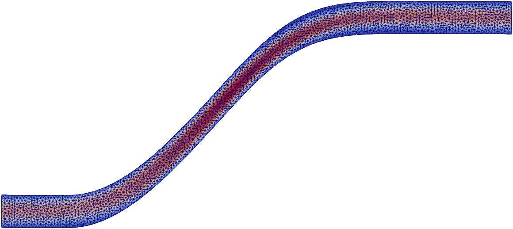
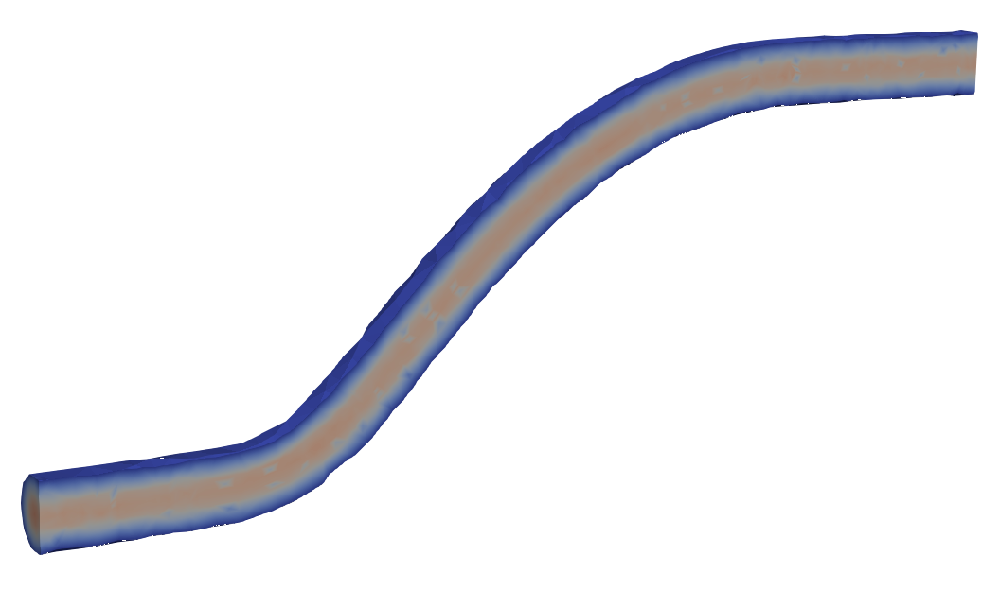
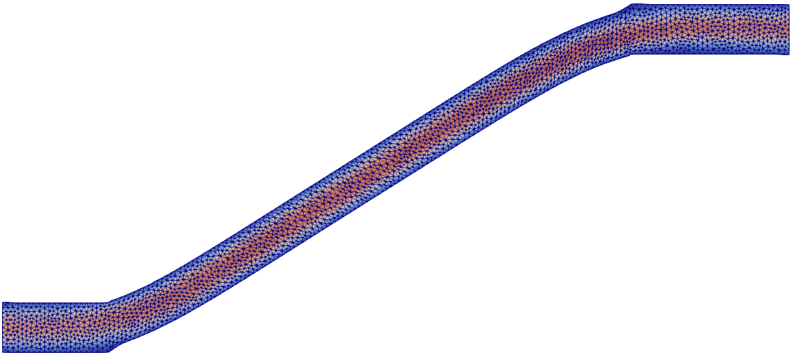
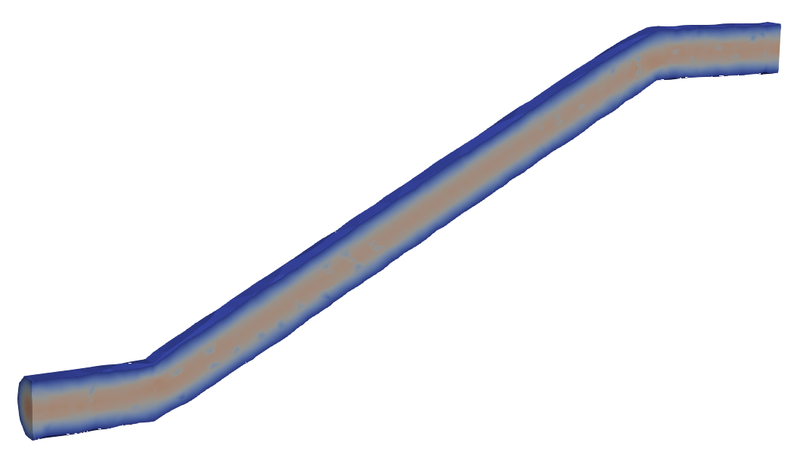

.. _example_pipe:
.. role:: bash(code)
   :language: bash

Example 3: Kinetic energy dissipation in a pipe
===============================================

In this example, we show how to minimize the shape functional

.. math::

    \mathcal{J}(\Omega) = \int_\Omega \nu \nabla \mathbf{u} : \nabla \mathbf{u} \,\mathrm{d}\mathbf{x}\,,

where :math:`\mathbf{u}:\mathbb{R}^d\to\mathbb{R^d}\,, d = 2,3,` is the velocity of an incompressible
fluid and :math:`\nu` is the fluid viscosity.
The fluid velocity :math:`\mathbf{u}` and the fluid pressure
:math:`p:\mathbb{R}^d\to\mathbb{R}` satisfy the incompressible Navier-Stokes
equations

.. math::
    :nowrap:

    \begin{align*}
    -\nu \Delta \mathbf{u} + \mathbf{u} \nabla \mathbf{u} + \nabla p &= 0 & \text{in } \Omega\,,\\
    \operatorname{div} \mathbf{u} &= 0& \text{in } \Omega\,,\\
    \mathbf{u} &= \mathbf{g} &\text{on } \partial\Omega\setminus \Gamma\,,\\
    p\mathbf{n} - \nu \nabla u\cdot \mathbf{n} & = 0 &\text{on } \Gamma\,.
    \end{align*}

Here, :math:`\mathbf{g}` is given by a Poiseuille flow at the inlet and is zero on the walls of the pipe.
The letter :math:`\Gamma` denotes the outlet.

In addition to the PDE-contstraint, we enforce a volume constraint:
the volume of the domain should remain constant during the optimization process.

Initial domain
^^^^^^^^^^^^^^

|pipe2D_initial| |pipe3D_initial|

.. centered:: *Initial pipe design in 2D (with mesh) and 3D, and magnitude of fluid velocity.*

For the 2D-example, the geometry of the initial domain is described in the following
`gmsh <http://gmsh.info/>`_ script (this has been tested with :bash:`gmsh v4.1.2`).

.. literalinclude:: ../../examples/pipe/pipe.geo
    :linenos:

The mesh can be generated typing :bash:`gmsh -2 -clscale 0.1 -format msh2 -o pipe.msh pipe.geo`
in the terminal.

For the 3D-example, the geometry of the initial domain is described in the following
`gmsh <http://gmsh.info/>`_ script.

.. literalinclude:: ../../examples/pipe/pipe3d.geo
    :linenos:

The mesh can be generated typing :bash:`gmsh -3 -clscale 0.2 -format msh2 -o pipe.msh pipe3d.geo`
in the terminal (this has been tested with :bash:`gmsh v4.1.2`).

Implementing the PDE constraint
^^^^^^^^^^^^^^^^^^^^^^^^^^^^^^^
We implement the boundary value problem that acts as PDE
constraint in a python module named :bash:`PDEconstraint_pipe.py`.
In the code, we highlight the lines which characterize
the weak formulation of this boundary value problem.

.. note::

    The Dirichlet boundary data :math:`\mathbf{g}` depends on the dimension :math:`d` (see *Lines 36-42*)

.. literalinclude:: ../../examples/pipe/PDEconstraint_pipe.py
    :emphasize-lines: 30,31, 43, 44
    :linenos:

.. note::

    The Navier-Stokes solver may fail to converge if
    too big an optimization step occurs in the optimization
    process. To address this issue,
    we use a trust-region algorithm as optimization solver, and
    we make the functional :math:`\mathcal{J}` return
    :bash:`NaN` whenever the state solver fails.
    This way,
    the trust-region method will notice that there is no improvement
    if the state solver fails and will thus reduce the trust-region radius.

    .. figure:: images/pipe2D_fail.png
        :width: 300
        :align: center

        If the trust-region radius is too large, the algorithm may try to
        evaluate the objective functional on a domain that is not feasible.
        In this case, the PDE-solver fails, the domain is rejected, and the
        trust-region radius is reduced.

Implementing the shape functional
^^^^^^^^^^^^^^^^^^^^^^^^^^^^^^^^^^^
We implement the shape functional :math:`\mathcal{J}`
in a python module named :bash:`objective_pipe.py`.
In the code, we highlight the lines
which characterize :math:`\mathcal{J}`.

.. literalinclude:: ../../examples/pipe/objective_pipe.py
    :emphasize-lines: 18-23
    :linenos:

Setting up and solving the problem
^^^^^^^^^^^^^^^^^^^^^^^^^^^^^^^^^^
We set up the problem in the script :bash:`main_pipe.py`.

To set up the problem, we need to:

* load the mesh of the initial guess (*Line 9*),
* choose the discretization of the control
  (*Line 10*, Lagrangian finite elements of degree 1),
* choose the metric of the control space
  (*Line 11*, :math:`H^1`-seminorm with homogeneous Dirichlet boundary conditions
  on fixed boundaries),
* initialize the PDE contraint on the physical mesh :bash:`mesh_m` (*Line 15-21*),
  choosing different viscosity parameters depending on the physical dimension `dim`
* specify to save the function :math:`\mathbf{u}` after each iteration
  in the file :bash:`solution/u.pvd` by setting the function ``cb``
  appropriately (*Lines 24-28*),
* initialize the shape functional (*Line 31*),
  and the reduced shape functional (*Line 32*),
* add a regularization term to improve the mesh quality
  in the updated domains (*Lines 35-36*),
* specify the volume equality constraint (*Lines 39-42*)
* create a ROL optimization prolem (*Lines 45-58*),
  and solve it (*Line 60*). Note that the volume equality constraint
  is imposed in *Line 58*.

.. literalinclude:: ../../examples/pipe/main_pipe.py
    :linenos:

.. note::

   This problem can also be solved using Bsplines to discretize the control.
   For instance, one could replace *Line 10-11* with

   .. code-block:: none

        bbox = [(1.5, 12.), (0, 6.)]
        orders = [4, 4]
        levels = [4, 3]
        Q = fs.BsplineControlSpace(mesh, bbox, orders, levels, boundary_regularities=[2, 0])
        inner = fs.H1InnerProduct(Q)

   In this case, the control is discretized using tensorized cubic (:bash:`order = [4, 4]`) Bsplines
   (roughly :math:`2^4` in the :math:`x`-direction :math:`\times\, 2^3` in the :math:`y`-direction;
   :bash:`levels = [4, 3]`).
   These Bsplines lie in the box with lower left corner :math:`(1.5, 0)` and upper right corner :math:`(12., 6.)`
   (:bash:`bbox = [(1.5, 12.), (0, 6.)]`).
   With :bash:`boundary_regularities = [2, 0]` we prescribe that the transformation vanishes for :math:`x=1.5`
   and :math:`x=12` with :math:`C^1`-regularity, but it does not
   necessarily vanish for :math:`y=0` and :math:`y=6`. In light of this,
   we do not need to specify :bash:`fixed_bids` in the inner product.

   Using Bsplines to discretize the control leads to similar results.

Result
^^^^^^

|pipe2D_final| |pipe3D_final|

.. centered:: *Optimized pipe design in 2D (left) and 3D (right).*

For the 2D-example, typing :bash:`python3 main_pipe.py` in the terminal returns:

.. code-block:: none

    Augmented Lagrangian Solver
    Subproblem Solver: Trust Region
      iter  fval           cnorm          gLnorm         snorm          penalty   feasTol   optTol    #fval   #grad   #cval   subIter 
      0     4.390787e-01   0.000000e+00   4.690997e-01                  1.00e+01  1.26e-01  1.00e-02  
      1     2.823114e-01   6.377197e-01   7.192107e-02   9.086354e-01   1.00e+02  1.26e-01  1.00e-01  15      11      22      10      
      2     3.266521e-01   9.002146e-03   2.942106e-01   4.741487e-01   1.00e+02  7.94e-02  1.00e-03  23      15      32      5       
      3     3.256262e-01   3.716964e-05   9.015756e-02   7.546472e-02   1.00e+02  5.01e-02  1.00e-04  36      25      53      10      
      4     3.251405e-01   6.469895e-06   5.961345e-02   4.412538e-02   1.00e+02  3.16e-02  1.00e-04  49      35      74      10      
      5     3.249782e-01   4.207885e-04   6.196224e-02   6.207929e-02   1.00e+02  2.00e-02  1.00e-04  62      45      95      10      
      6     3.248956e-01   1.972863e-05   8.589613e-03   9.381617e-03   1.00e+02  1.26e-02  1.00e-04  75      55      116     10      
    Optimization Terminated with Status: Converged

.. note::
    To store the terminal output in a txt file, use the bash command
    :bash:`python3 main_pipe.py >> output.txt`.

We can inspect the result by opening the file :bash:`u.pvd`
with `ParaView <https://www.paraview.org/>`_. We see that the
difference between the volume of the initial guess and of the
retrieved optimized design is roughly :math:`2\cdot 10^{-5}`.

For the 3D-example, typing :bash:`python3 main_pipe.py` in the terminal returns:

.. code-block:: none

    Augmented Lagrangian Solver
    Subproblem Solver: Trust Region
      iter  fval           cnorm          gLnorm         snorm          penalty   feasTol   optTol    #fval   #grad   #cval   subIter 
      0     1.211321e+01   0.000000e+00   1.000000e+00                  1.50e+01  1.00e-01  1.00e-02  
      1     8.681223e+00   1.932438e+00   1.998650e-01   1.058693e+00   1.50e+02  8.72e-02  6.65e-02  15      13      24      10      
      2     1.111633e+01   2.419067e-02   3.687839e-01   1.333067e+00   1.50e+02  5.28e-02  4.42e-04  23      19      36      5       
      3     1.114521e+01   1.079619e-03   3.528500e-01   1.243047e-01   1.50e+02  3.20e-02  1.00e-04  36      29      57      10      
      4     1.113536e+01   7.521605e-04   6.820438e-02   1.229308e-01   1.50e+02  1.94e-02  1.00e-04  49      39      78      10      
      5     1.113373e+01   5.221684e-04   1.130481e-01   9.808759e-02   1.50e+02  1.17e-02  1.00e-04  62      49      99      10      
      6     1.113360e+01   3.785105e-04   5.083579e-02   7.107051e-02   1.50e+02  7.11e-03  1.00e-04  75      59      120     10      
      7     1.113168e+01   2.478858e-04   8.290102e-02   4.790457e-02   1.50e+02  4.30e-03  1.00e-04  88      69      141     10      
      8     1.113127e+01   6.115143e-05   6.973287e-02   4.889087e-02   1.50e+02  2.61e-03  1.00e-04  101     79      162     10      
      9     1.113080e+01   1.956210e-04   3.754803e-02   3.813478e-02   1.50e+02  1.58e-03  1.00e-04  114     89      183     10      
      10    1.112986e+01   5.181766e-06   3.406590e-02   2.990831e-02   1.50e+02  1.00e-03  1.00e-04  127     99      204     10      
    Optimization Terminated with Status: Iteration Limit Exceeded

We can inspect the result by opening the file :bash:`u.pvd`
with `ParaView <https://www.paraview.org/>`_. We see that the
difference between the volume of the initial guess and of the
retrieved optimized design is roughly :math:`5\cdot 10^{-6}`.
